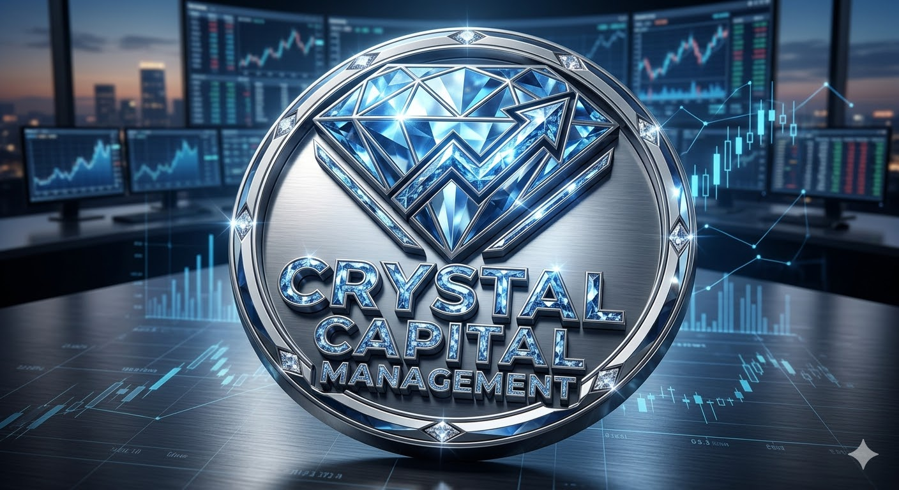

  

# 🏛 CRYSTAL CAPITAL MANAGEMENT & DAO
### Quantitative Asset Management | Systematic Risk Execution | RWA Tokenization

Crystal Capital is a decentralized quantitative investment protocol and alternative asset manager. We replace discretionary human bias and market forecasting with systematic statistical arbitrage, rigorous risk management, and Real-World Asset (RWA) infrastructure tokenization.

---

## 📊 1. Quantitative Core & Risk Framework
* **Zero-Forecast Methodology:** Exploiting structural order-book imbalances, mean reversion, and mathematical expectation rather than directional market speculation.
* **Strict Capital Protection:** Strict per-trade risk allocation (0.5%–1.0%), zero martingale exposure, and an institutional hard stop on drawdowns.
* **Separately Managed Accounts (SMA):** Non-custodial capital execution via trade-only API architecture (Bybit, Hyperliquid, BingX).
* 📄 **[Open Quantitative Core & Risk Framework](quantative-core.md)**

---

## 🌱 2. RWA Division: Project C-Fusion (UAE)
* **Industrial AgTech Infrastructure:** Fully automated industrial cultivation facility for high-value gourmet mushrooms in the United Arab Emirates (1,200 m² base facility).
* **Asset-Backed Yield:** The `cFUNGI` smart contract protocol backed by physical infrastructure, secured off-take agreements, and real operational cash flows ($EBITDA$).
* **Investor Waterfall Distribution:** Tiered capital return structure (80/20 preference until 100% principal recovery, shifting to a 50/50 long-term dividend split).
* 🍄 **[Open C-Fusion Investment Memorandum (1,200 m² / ROI 200%+)](c-fusion.md)**

---

## 📈 3. Investor Relations & Due Diligence Room
* 📊 **[Performance Analytics & Risk Protocol](performance-and-audit.md)** *(KPI benchmarks, Sharpe/Sortino ratios, Drawdown controls)*
* 💎 **[Crystal Capital Index & Internal Tokenomics](tokenomics-index.md)** *(TON smart-contract vehicle, NAV accounting, Liquidity)*
* ⚖️ **[Legal Structure & Governance](legal-and-governance.md)** *(Non-custodial architecture, SPV framework, Compliance)*
* 🚀 **[Investor Onboarding Process](onboarding.md)** *(Mandate, SMA connection, Settlement)*

---

## 🌐 4. Institutional Inquiries & Partnerships
* **Headquarters:** Dubai, United Arab Emirates
* **Focus Segments:** Family Offices, Institutional Capital Allocators, Web3 Syndicates
* **Ecosystem Architecture:** 
  * Asset Management: Crystal Capital DAO
  * AgTech & RWA Infrastructure: C-Fusion Protocol

---
*© 2026 Crystal Capital Management. All rights reserved.*
